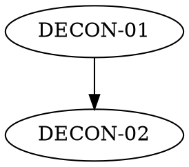

# <Project> Regeneration Pack — MANIFEST

**Source:** <repo url or path> at commit `<hash>` (<YYYY-MM-DD>)
**Generated by:** the /deconstruct skill
**Contract:** an implementation in any language that satisfies every DECON
epic below and reproduces all golden vectors is a functional regeneration of
the source. Everything else — language, layout, internal design — is the
implementer's choice.

## Goal
<!-- One paragraph: what this domain is and does. -->

## Epics & build order
| # | Epic | Scope (one line) | Depends on |
|---|---|---|---|
| 01 | `DECON-01_Name.md` | <scope> | — |

## Perspectives taxonomy
| Perspective | Rating | Evidence | Boundary invariant |
|---|---|---|---|
| God-mode | Full/Partial/Absent | <evidence> | <invariant> |
| Administrative | … | … | … |
| User/client | … | … | … |
| Observer/operator | … | … | … |
| Performant *(lens)* | … | … | characteristic, informative unless SD-flagged |
| Flexibility *(lens)* | … | … | characteristic, informative unless SD-flagged |

## Coverage
| Observable behavior | Epic | Notes |
|---|---|---|
<!-- Every public behavior maps to an epic — or appears in Out of scope. -->

## Out of scope
| Item | Why |
|---|---|

## Spec decisions index
| ID | Epic | Decision |
|---|---|---|

## Drift log
<!-- Update mode only: | commit range | behavior change | epics touched | -->
